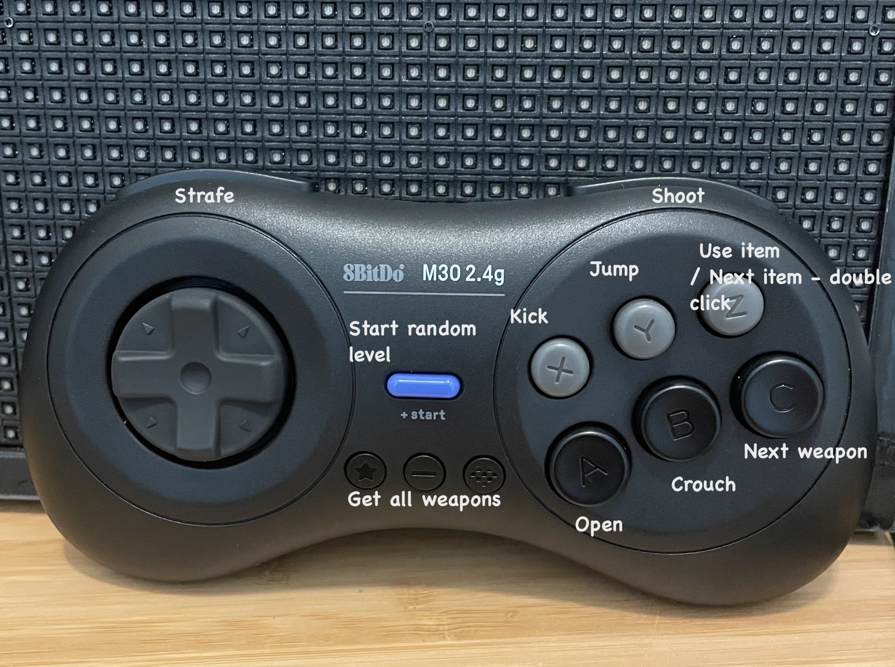

# duke3d-matrix: picture frame

Runs Duke Nukem 3D on a LED matricx as a wall frame connected to a Raspberry Pi.
The work is based on [Doom Matrix](https://github.com/bestander/doom-matrix) (which itself is a fork of @twstokes's project) that started as
a question "But can you run Duke on it?".

## Features

- Preconfigured to run on 2 64x32 LED panels
- Gamepad support: full gameplay
- Sleep timer when gamepad is not active
- Displays current time and weather forecast at the unused bottom line of the screen

**Made possible thanks to these libraries:**
- [eduke32](https://github.com/bestander/eduke32), forked https://voidpoint.io/terminx/eduke32
- [rpi-rgb-led-matrix](https://github.com/hzeller/rpi-rgb-led-matrix)
- [SDL2](https://github.com/libsdl-org/SDL) / [SDL_mixer 2](https://github.com/libsdl-org/SDL_mixer)
- [Meteosource](https://github.com/Meteosource/meteosource_cpp)

## Hardware
- [64x32 LED P5 Matrix](https://www.adafruit.com/product/2277) x2
- [Adafruit RGB Matrix Bonnet](https://www.adafruit.com/product/3211)
- [5V 4A Power Supply](https://www.adafruit.com/product/1466)
- Raspberry Pi 3B+
- USB Gamepad (I used [8Bitdo M30 2.4G Wireless Gamepad for Sega Genesis Mini](https://www.amazon.com/dp/B07XPHP57T) because it has enough buttons and is wireless but a wired one will work too)
- 3D printer

## Setup tooling and libraries

1. Install C and C++ compilers + `make` for your OS
1. Fetch the dependency submodules with `git submodule update --init --recursive --depth=1`
1. Run `./compile-all.sh`, if it succeeds it will create a binary

You most likely will need the following libraries installed in RPI

`sudo apt-get install libasound2-dev libflac-dev libvpx-dev fluid-soundfont-gm freepats timidity fluidsynth libjsoncpp-dev libcurl4-openssl-dev`

### Audio

Audio should be decently turn-key, but can take a little more work. It's not recommended to use the on-board audio on the Pi while driving the matrix for performance reasons, so it's best to disable it on boot. However I used headphone jack ([a speaker](https://www.amazon.com/dp/B0BM996CD9))on Raspberry Pi 3 without problems.

**Note:** 
- It can take a while to compile these on a Pi! You can also consider cross-compiling from a faster machine.
- If your distro has SDL packages you can install them instead.
- Even if running `eduke32` as `root`, you'll probably need to add your user to the appropriate `audio` group.

## Building the project

`make`

### Cleaning

`make clean`

## Running

The binary accepts arguments for both [rpi-rgb-led-matrix](https://github.com/hzeller/rpi-rgb-led-matrix/tree/master) and [eduke32](https://github.com/bestander/eduke32), all the necessary params to run it on a double LED matrix on a Raspberry Pi3 are in script `run.sh`.

If you want for the board to also show temperature forecast from [Meteosource](https://github.com/Meteosource/meteosource_cpp) you need to register on the website (free) and generate an API token and pass it to the run.sh script:

`./run.sh --metsource_key=<my-api-key> --metsource_location=nocatee-7315235 --refresh_weather_timer_sec=3600`

If you don't want the game to play nonstop you can pass the following parameter to pause it if there is no gamepad activity.
It will automatically wake up on any gamepad button click and when weather is refreshed. 

`./run.sh --sleep_timeout_sec=300`

## Controls

eduje32.cfg is included in this repo and is already configured for a SEGA style 8bit-do gamepad.

Note the Random_Level and Get_Stuff commands bound to buttons 8 and 9, those are not standard for eduke and a part of the fork.
